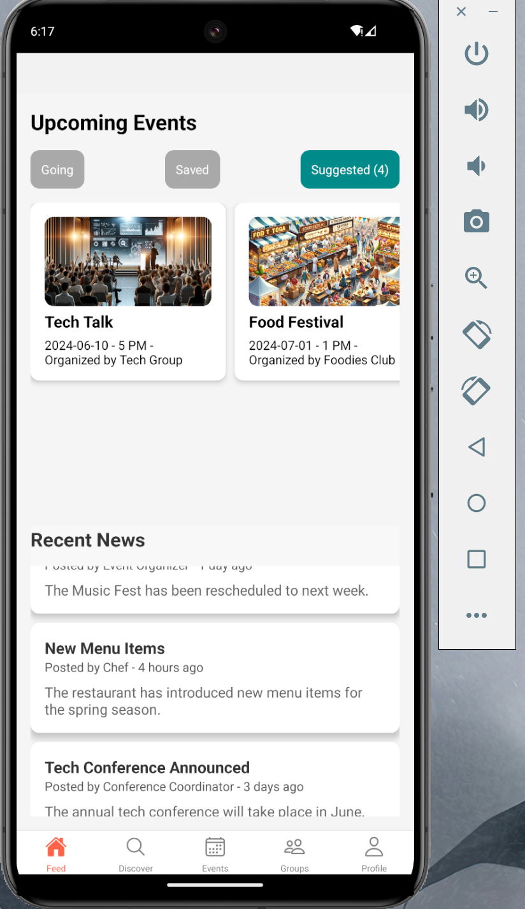

# Tech for Mobile Apps

## Instructor:  Dr William Akotam Agangiba.

# Project Topic/Title : Campus Connect.

# Team members

1. Pramod Reddy Pandiri , pandirpy@mail.uc.edu
2. Vijay Kumar Vemana, vemanava@mail.uc.edu


# Project Management Information

Source code repository (private access): [https://github.com/Tech-for-mobile-apps/tma_project](https://github.com/Tech-for-mobile-apps/tma_project)


# Overview
Campus connect is a mobile application for the students to improve their social life on campus. With this app students can expand their cultural knowledge by connecting with other likeminded students.
This app tries to solve a problem of not being able to find and organise events for small groups.

# Features

- Students can find  events based on their interests.
- Students can RSVP, Save to  events based on their interests.
- Students will get events suggestions based on their activity,
- Students can join various on campus groups
- Studenst can connect with other students over this app.
- Students can organise events and host only limited people.
- Students can read articles about whats' happeing on campus.
- Connect with other students via app.

# Technologies used

- React Native

# Programming languages

- Javascript.

# Implemenatation 

We have used react-native library to build our mobile, chosing react-native is making our application compatible for both iOs and Andriod devices. We have build screens based on design with inbuilt native components.

> The below is the login screen, this is initial screen with valid credentials user can login.


> After login , user is directed to first screen i.e ```Feed```. There user can see his ```Going events```, ```Saved Events```, ``` Suggested events```. In Events section.


 > In the ```Feed``` , there another section called , ```Recent News```. There students can read about lastest news about the events in campus. 




> In the menu , next screen is ``` Discover```. In this screen students can find various events and people.


> By click on the event , student can see details of the event.


> if the student choose to attend the event , student can click on ```RSVP```. As the below image. User can see success notification.


>  ```RSVP``` button turns green on confirming the event.


> In the ```Discover``` screen , user can send connection request to other people with similar interests by clicking on ```Connect```. You will see a connection sent notification.


> Upon successfull connection ```Connect``` in blue truns to ```Connected``` in green.


> The next screen in menu is ```Calender```. This is basically to view your attending events by schedule. by clicking on specific date you can see events scheduled on that date. As in the below image.


> You can see events in future by selecting year, month. As in the below two images.


> User can host an event, by clicking on teh ```+``` icon in the bottom right, user fill all details ```Event Form``` as show in image.


> After clicking on ```Save Event```,  You will see a success notifiction.


> Now you can check the prevously added event on the calender.


> In the main menu, next screen is ```Groups```. In the top section user can see ```My Groups``` where already joined , in the bottom section he can see ```Suggested groups```.


> User can join any group by click in ```Join``` on the right side of the gorup card.


> After successfully joining user can see that group in ```My Groups``` section.


> Last screen in main menu is ```Profile```. Here user can do edit profile, change preferences, get support, manage accout.  


> User can change details, add profile photo in the ```Edit Profile ``` screen. Click on ```Save Changes``` will update user details.


> Here user can choose to logout by clicking on ```Log Out```.


